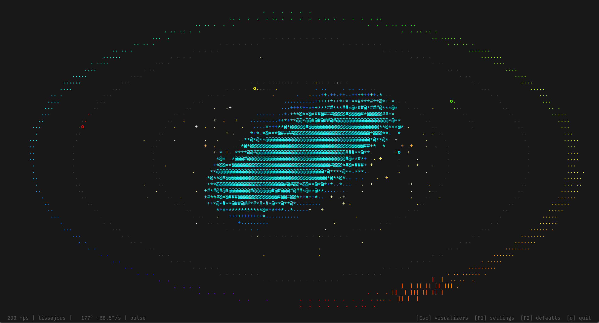
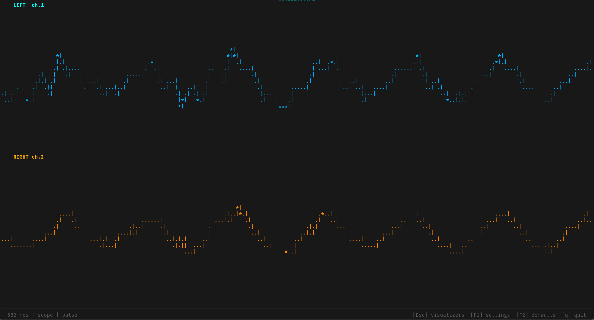

# audio_viz

A multi-mode terminal audio visualizer written in Rust. Captures system audio
and renders real-time ASCII visualizations in your terminal using 256-colour
ANSI escape codes.

**Try the Web Version:** [https://nitepone.github.io/audio_viz/](https://nitepone.github.io/audio_viz/)

<p align="center">
  
  
</p>

```
./audio_viz lissajous
./audio_viz spectrum
./audio_viz fire
```

---

## Requirements

### Linux
- PipeWire or PulseAudio (for system audio capture)
- `libasound2-plugins` — provides the ALSA `pulse` device bridge
- `pulseaudio-utils` — provides `pactl` for monitor source detection

```bash
sudo apt install libasound2-plugins pulseaudio-utils
```

### macOS
- [BlackHole](https://existential.audio/blackhole/) — virtual loopback driver for system audio capture

```bash
brew install --cask blackhole-2ch
```

After installing, set BlackHole 2ch as your audio output in System Settings → Sound, or create a Multi-Output Device in Audio MIDI Setup to hear audio simultaneously while capturing it.

### Windows
WASAPI exposes a loopback device for every output device automatically — no additional software required. Run `--list-devices` and look for entries ending in `[Loopback]`:

```powershell
audio_viz --list-devices
# Example output:
#   [0] Speakers (High Definition Audio Device)
#   [1] Speakers (High Definition Audio Device) [Loopback]   ← use this
audio_viz --device "Speakers (High Definition Audio Device) [Loopback]"
# or by index:
audio_viz --device 1
```

If no `[Loopback]` entries appear (some driver versions omit them), install [VB-Cable](https://vb-audio.com/Cable/) as a fallback — download and run the installer as Administrator, reboot, then set **CABLE Input** as your default playback device and use **CABLE Output** as the capture device.

---

## Installation

Pre-built binaries are attached to each [GitHub Release](../../releases) for Linux (x86_64), macOS (x86_64), and macOS (Apple Silicon). A `.deb` package and an AppImage are also provided for Linux.

To build from source:

```bash
cargo build --release
./target/release/audio_viz
```

---

## Usage

```
audio_viz [VISUALIZER] [OPTIONS]

Arguments:
  [VISUALIZER]   Visualizer to run [default: spectrum]

Options:
  -d, --device <DEVICE>   Audio input device name or index
  -l, --list              List all available visualizers
      --list-devices      List all available audio input devices
      --fps <FPS>         Target frames per second [default: 45]
  -h, --help              Show help
```

---

## Visualizers

| Name | Description |
|---|---|
| `spectrum` | Log-spaced frequency bars with peak markers |
| `scope` | Dual-channel (or mono) time-domain oscilloscope |
| `matrix` | Audio-reactive falling character rain |
| `radial` | Polar spectrum radiating from the centre |
| `lissajous` | Full-terminal XY oscilloscope — beat rotation, planets, vocal stars, ripples |
| `fire` | Audio-reactive ASCII fire |
| `vu` | Stereo / mono VU meter |

---

## Settings

Each visualizer has a runtime-configurable set of parameters accessible via
`F1`. Settings are persisted between sessions.

| Platform | Config location |
|---|---|
| Linux | `$XDG_CONFIG_HOME/audio_viz/` (default: `~/.config/audio_viz/`) |
| macOS | `~/Library/Application Support/audio_viz/` |

---

## Architecture

```
audio_viz/
├── .github/
│   └── workflows/
│       └── build.yml            — CI: build, package, and release
├── Cargo.toml
├── build.rs                     — auto-discovers visualizer files at compile time
└── src/
    ├── main.rs                  — CLI, audio capture, FFT pipeline, render loop,
    │                              settings overlay, visualizer picker
    ├── visualizer.rs            — Visualizer trait, AudioFrame, shared DSP helpers,
    │                              config path/merge utilities, status_bar
    └── visualizers/
        ├── mod.rs               — includes build.rs-generated registry
        ├── spectrum.rs
        ├── scope.rs
        ├── matrix.rs
        ├── radial.rs
        ├── lissajous.rs
        ├── fire.rs
        └── vu.rs
```

**Audio pipeline:** `cpal` captures raw PCM from the system audio source into a
ring buffer. Each render frame, the main thread drains the buffer, applies a
Hann window, and computes an rfft magnitude spectrum via `rustfft`. The
resulting `AudioFrame` (left, right, mono, fft) is passed to the active
visualizer's `tick()` and `render()` methods.

**Registry:** `build.rs` scans `src/visualizers/*.rs` at compile time and
generates `OUT_DIR/registry.rs`, which declares each file as a `pub mod` with
an absolute `#[path]` attribute and emits an `all_visualizers()` factory that
calls each file's `register()` function. This is `include!`-ed by
`src/visualizers/mod.rs`. Adding a new visualizer requires no changes to any
existing file.

**Config system:** Each visualizer implements a JSON config schema describing
its settings (name, type, value, optional min/max, optional variants). On
startup the persisted config is loaded and merged against the schema — unknown
keys are dropped, missing keys are filled from defaults, and out-of-range values
fall back to defaults. The cleaned result is written back immediately, keeping
config files up to date across version changes.

**Stderr silencing (Linux):** ALSA and JACK write diagnostics directly to
file-descriptor 2, bypassing Rust's stderr, including from cpal's internal
audio callback thread. `stderr_silence::suppress()` saves the real fd 2 and
permanently redirects it to `/dev/null` before the first cpal call. The
`diag!()` macro writes to the saved fd so application messages still reach the
terminal.

---

## Adding a Visualizer

1. Create `src/visualizers/myvis.rs`
2. Implement the `Visualizer` trait (including `get_default_config` and `set_config`)
3. Export `pub fn register() -> Vec<Box<dyn Visualizer>>`
4. Add a match arm in `main.rs` to inject the device name
5. Run `cargo build` — it appears automatically in `--list` and the visualizer picker

Minimal example:

```rust
use crate::visualizer::{
    merge_config, pad_frame, status_bar, AudioFrame, TermSize, Visualizer,
};

const CONFIG_VERSION: u64 = 1;

pub struct MyViz {
    source: String,
    gain:   f32,
}

impl MyViz {
    pub fn new(source: &str) -> Self {
        Self { source: source.to_string(), gain: 1.0 }
    }
}

impl Visualizer for MyViz {
    fn name(&self)        -> &str { "myvis" }
    fn description(&self) -> &str { "My visualizer" }

    fn get_default_config(&self) -> String {
        serde_json::json!({
            "visualizer_name": "myvis",
            "version": CONFIG_VERSION,
            "config": [
                { "name": "gain", "display_name": "Gain",
                  "type": "float", "value": 1.0, "min": 0.0, "max": 4.0 }
            ]
        }).to_string()
    }

    fn set_config(&mut self, json: &str) -> Result<String, String> {
        let merged = merge_config(&self.get_default_config(), json);
        let val: serde_json::Value = serde_json::from_str(&merged)
            .map_err(|e| e.to_string())?;
        if let Some(config) = val["config"].as_array() {
            for entry in config {
                if entry["name"].as_str() == Some("gain") {
                    self.gain = entry["value"].as_f64().unwrap_or(1.0) as f32;
                }
            }
        }
        Ok(merged)
    }

    fn tick(&mut self, _audio: &AudioFrame, _dt: f32, _size: TermSize) {}

    fn render(&self, size: TermSize, fps: f32) -> Vec<String> {
        let rows = size.rows as usize;
        let cols = size.cols as usize;
        let mut lines = vec!["hello, world!".to_string()];
        lines.push(status_bar(cols, fps, self.name(), &self.source, ""));
        pad_frame(lines, rows, cols)
    }
}

pub fn register() -> Vec<Box<dyn Visualizer>> {
    vec![Box::new(MyViz::new(""))]
}
```

Then add a match arm in `main.rs`:

```rust
"myvis" => Box::new(visualizers::myvis::MyViz::new(&device_name)),
```

See `src/visualizers/vu.rs` for a fully annotated reference implementation.

---

## Developer Notes

**`diag!()` vs `eprintln!()`**
On Linux, `eprintln!` writes to fd 2 which is permanently redirected to
`/dev/null` once the audio subsystem starts. Use `diag!()` for any message
that needs to reach the terminal after that point. `eprintln!` is fine for
errors that occur before audio initialisation (e.g. argument parsing).

**`lissajous.rs` is complex**
It has eight rendering layers (orbit rings, spokes, phase dots, nucleus, vocal
stars, planets, beat ripples, spectrum shell) and several interacting subsystems
(beat detector, rotation physics, vocal onset detector, planet orbital
mechanics). Everything is documented inline. The geometry caches
(`ring_cache`, `shell_cache`) are populated in `tick()` — not `render()` —
because `render()` takes `&self` and cannot mutate state.

**Runtime plugin loading**
The current registry is compile-time only. The `Visualizer` trait is already
the right shape for runtime plugins: extract `visualizer.rs` into a
`audio_viz_core` crate, have plugins export
`extern "C" fn viz_register() -> *mut Vec<Box<dyn Visualizer>>`, and load them
with `libloading`. Nothing about the trait needs to change.
